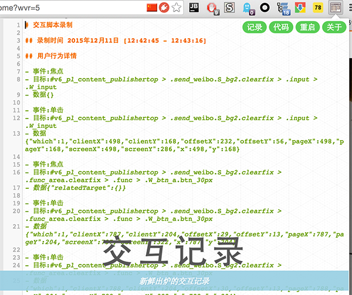
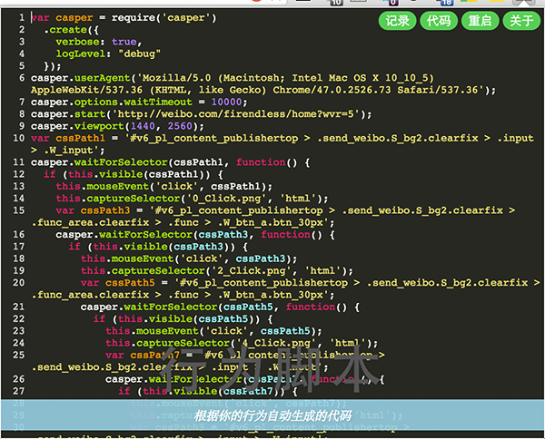

- [中文文档](./doc/introduction-cn.md)

## Fox


Fox is a chrome extension which help you do something better: User Interface Testing/ Replay/ Monitor/ Analytics.

## HOW TO USE

### INSTALL CHROME EXTENSION

- Install From Chrome Store

  [Chrome Store](https://chrome.google.com/webstore/detail/fox/noihogblgddclholifdahnipgpnpcemb?hl=zh-CN)

- Install From Dev Preview Crx

  [Dev Preview Crx](https://github.com/soulteary/fox/releases)

### RUN APP AT CHROME TOOLBAR

Clicking the icon which at chrome extension toolbar, then everything will be recording by fox.
 
### STOP APP

Reclick same icon will stop the record.

### USER ACTION REVIEW

Reclick icon, prev action history will show you as a popup window.


## SINGLE MODE

```
npm run mock-server

```

## SNAPSHOT






## THANKS

	Can't image coding without those useful tools.

<table>
<thead></thead>
<tbody>
  <tr>
    <td align="center">
      <a target="_blank" href="http://gulpjs.com/">
        
        <div>gulp</div>
      </a>
    </td>
    <td align="center">
      <a target="_blank" href="https://webpack.github.io">
        
        <div>webpack</div>
      </a>
    </td>
    <td align="center">
      <a target="_blank" href="https://github.com/eslint/eslint">
        
        <div>eslint</div>
      </a>
    </td>
    <td align="center">
      <a target="_blank" href="http://casperjs.org/">
        
        <div>casperjs</div>
      </a>
    </td>
  </tr>

 <tr>
    <td align="center">
      <a target="_blank" href="http://phantomjs.org/">
        
        <div>phantomjs</div>
      </a>
    </td>

    <td align="center">
      <a target="_blank" href="https://github.com/jquery/jquery">
        
        <div>jquery</div>
      </a>
    </td>
    <td align="center">
      <a target="_blank" href="https://github.com/beautify-web/js-beautify">
        
        <div>js-beautify</div>
      </a>
    </td>
    <td align="center">
      <a target="_blank" href="http://momentjs.com/">
        
        <div>momentjs</div>
      </a>
    </td>
  </tr>

</tbody>
</table>


## LICENSE

MIT