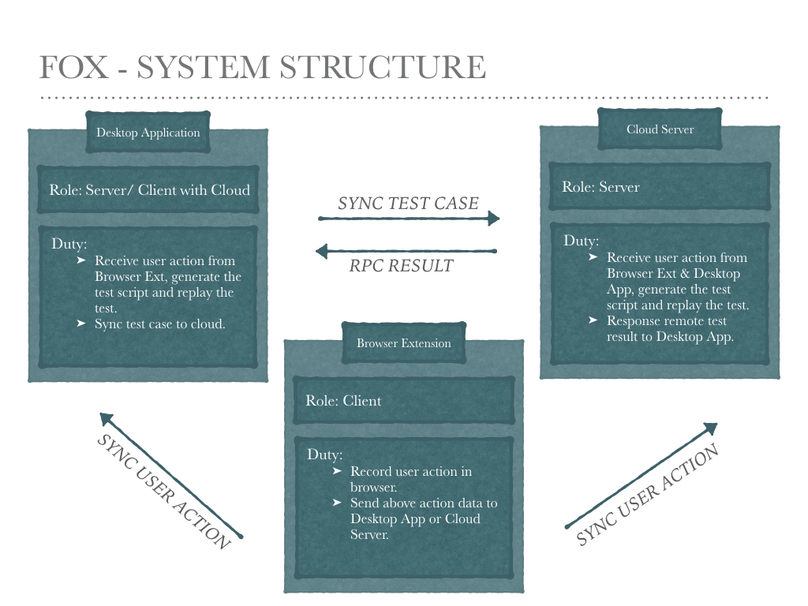

``项目正在大幅改动，不妨留个脚印，稍后再看。 ^-^``

# Fox

> 致力成为可靠易用的界面测试工具。

## 景愿

可信赖, 易用的界面测试工具。

## 源码

<table>
<thead>
  <tr>
    <td align="center" colspan="3">查看源码</td>
  </tr>
</thead>
<tbody>
  <tr>
    <td align="center">
      <a target="_blank" href="https://github.com/soulteary/fox/tree/chrome-extension">
        
        <div>浏览器插件</div>
      </a>
    </td>
    <td align="center">
      <a target="_blank" href="https://github.com/soulteary/fox/tree/desktop-application">
        
        <div>桌面客户端</div>
      </a>
    </td>
    <td align="center">
      <a target="_blank" href="https://github.com/soulteary/fox/tree/cloud-server">
        
        <div>服务端程序</div>
      </a>
    </td>
  </tr>
</tbody>
</table>


## 截图预览

(稍后更新...)

## 系统组成



工具目前由三部分组成，分别是：

1.[**浏览器插件**](https://github.com/soulteary/fox/tree/chrome-extension)(完善中)，负责录制用户行为以及将行为数据发送至桌面客户端或服务端程序。

2.[**桌面客户端**](https://github.com/soulteary/fox/tree/desktop-application)(开发中)，负责接收录制到的行为数据，以及生成测试用例代码，并执行测试展示结果。

3.[**服务端程序**](https://github.com/soulteary/fox/tree/chrome-extension/server)(完善中)，负责接收录制到的行为数据，以及生成测试用例代码，并执行测试展示结果。

### 浏览器插件

目前仅提供chrome插件，后续计划提供Safari、Firefox插件，以及独立于浏览器的最小版本的录制脚本。

### 桌面客户端

使用Electron构建的桌面程序，目前主要集中精力开发mac客户端，稍后进行win/linux客户端的测试。

### 服务端程序

使用nginx & nodejs 提供的服务端程序。


## 开发构建

- [构建桌面客户端](#)

```bash
$ git clone -b desktop-application --single-branch git@github.com:soulteary/fox.git desktop-application
```


- [构建浏览器插件](#)

```bash
$ git clone -b chrome-extension --single-branch git@github.com:soulteary/fox.git chrome-extension
```

- [构建服务端程序](#)

```bash
$ git clone -b cloud-server --single-branch git@github.com:soulteary/fox.git cloud-server
```

