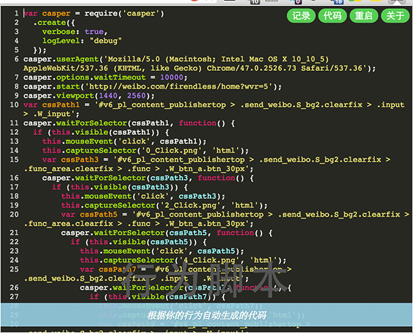

## Fox


Fox 是一款旨在帮助你把一些事情做的更好的浏览器插件，主要会着力解决和界面强耦合的用户行为测试、用户行为重放、监控到的用户行为分析。

## 如何使用

### 安装Chrome浏览器插件

- 从Chrome应用商店安装试用预览版

  [Chrome应用商店](https://chrome.google.com/webstore/detail/fox/noihogblgddclholifdahnipgpnpcemb?hl=zh-CN)

- 从GitHub获取插件预览版

  [Dev开发版安装包](https://github.com/soulteary/fox/releases)

### 运行插件

点击位于Chrome浏览器工具栏的插件图标，接下来当前页面的一切用户行为都可以尽在掌控了。

### 结束录制

再次点击插件图标，将会停止录制脚本。

### 用户行为预览

再次点击图标，之前的行为记录将会以弹出窗的形式呈现给你。


## 运行模式

Fox 提供了单机模式以及云端模式，如果你期望一切都是本地的，那么可以使用单机模式，如果你期望只是安装一个浏览器插件，那么可以选择云端模式。

### 单机模式

#### 环境准备

- 参考[phantomjs官方文档](http://phantomjs.org/download.html)结合自己的系统环境，安装phantomjs。

- 参考[casperjs官方文档](http://docs.casperjs.org/en/latest/installation.html#installing-from-git)，从GIT安装casperjs最新版本。

- 参考[nvm官方文档](https://github.com/creationix/nvm)，安装Node最新版本。

然后使用NPM启动本地模拟服务器：

```
npm run mock-server
```

### 云端模式

- 什么都不用管，安装插件使用即可。

## 视频预览

[土豆网](http://www.tudou.com/programs/view/LTzq74V06Jk/)

## 截图预览




## 开发相关

请参考[调试开发文档](./development.md)。

## 协议

MIT
